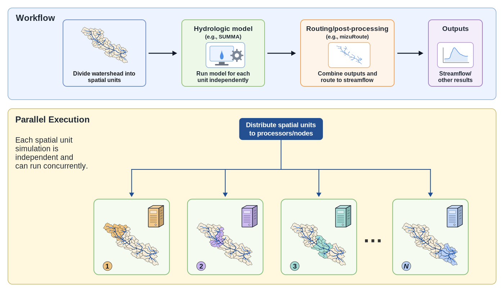

# Scenario 1: Parallel Execution of a Distributed Hydrologic Model

This scenario focuses on a distributed SUMMA-mizuRoute workflow for the Bow River basin in Alberta, Canada. The watershed domain is divided into 52 spatial units called grouped response units (GRUs). In this model configuration, SUMMA simulates each GRU independently, and mizuRoute routes the resulting runoff to the basin outlet, where streamflow is compared to observations at the Banff streamflow gauge.

The workflow is currently implemented as a serial script that executes SUMMA once per GRU. Starting from this serial workflow, you will run the baseline model, modify the SUMMA portion to execute multiple GRUs at the same time, and evaluate how runtime and efficiency change as CPU cores are added.

The diagnostic comparison uses the modified Kling-Gupta efficiency ($\mathrm{KGE}^{\prime}$) from [Kling et al. (2012)](https://doi.org/10.1016/j.jhydrol.2012.01.011) over the daily evaluation period from October 1, 2003, through September 30, 2005. For simulated and observed streamflow, let $r$ be their correlation, $\mu_s$ and $\mu_o$ be their means, and $\sigma_s$ and $\sigma_o$ be their standard deviations. The coefficient-of-variation ratio is $\gamma=(\sigma_s/\mu_s)/(\sigma_o/\mu_o)$, and the mean bias ratio is $\beta=\mu_s/\mu_o$. The diagnostic script computes

$$
\mathrm{KGE}^{\prime} = 1 - \sqrt{(r - 1)^2 + (\gamma - 1)^2 + (\beta - 1)^2}.
$$

Larger modified KGE values indicate better agreement between simulated and observed streamflow. After completing the simulation, the resulting value is written to the file `results/KGE.txt`.

## 1. Serial Workflow

If you are using the [`vhpc-hydrotools` virtual cluster](https://github.com/tristanmontoya/vhpc-hydrotools), change into the repository checkout:

```sh
cd /workspace/hydrolearn-hpc
```

If you are using another Slurm cluster, clone the repository yourself in a location of your choice:

```sh
git clone https://github.com/tristanmontoya/hydrolearn-hpc.git
cd hydrolearn-hpc
```

Then change into the case directory:

```sh
cd bow_at_banff_distributed_execution
```

Before editing anything, inspect the structure of the serial workflow. The workflow script executes SUMMA and mizuRoute, whereas the submission script requests computing resources from Slurm. Inspect the following files:

```
scripts/run_SUMMA_mizuRoute.sh
scripts/submit_run.sh
```

In `run_SUMMA_mizuRoute.sh`, SUMMA is executed sequentially over all GRUs:

```bash
for gru_index in $(seq 1 "${n_gru}"); do
    "${summa_exe}" -g "${gru_index}" 1 -r never -m "${summa_filemanager}"
done
```

SUMMA can run a subset of consecutively numbered GRUs with this command syntax:

```sh
summa.exe -m master_file -g startGRU countGRU [-r freqRestart]
```

In this command, `startGRU` is the first GRU index, `countGRU` is the number of consecutive GRUs to simulate, and `-r` controls restart output. For example, `-r never` disables restart output.

In this workflow, each SUMMA model call passes one GRU at a time:

```text
-g "${gru_index}" 1
```

This sets `startGRU = gru_index` and `countGRU = 1`, so each SUMMA execution simulates **exactly one GRU**.

Submit the baseline model through Slurm:

```sh
sbatch scripts/submit_run.sh
```

Slurm will print a line such as `Submitted batch job 123456`. Replace `123456` with your job ID when checking the queue:

```sh
squeue -u "$USER" --Format=JobID,Name,StateCompact:4,TimeUsed:8,CPUsPerTask:12,NodeList
```

After the job finishes, use the same job ID to inspect the Slurm output and modified KGE diagnostics:

```sh
cat slurm-bow-distributed-123456.out
cat slurm-bow-distributed-123456.err
cat results/KGE.txt
ls results/obs_vs_sim.png
```

Then record the allocated CPU core count and runtime from Slurm accounting:

```sh
sacct -j 123456 --format=JobID,NCPUS,Elapsed
```

**Deliverable:** the *Serial Workflow* section of your memo must provide a high-level overview of the workflow and address the following questions:

- What are the roles of SUMMA and mizuRoute in this workflow?
- Why does the serial workflow execute SUMMA once per GRU?
- Which parts of the workflow are naturally parallelizable?
- Why does requesting additional CPU cores through Slurm alone **not** speed up the serial workflow?

## 2. Parallelization

Figure 6 illustrates the computational pattern used in this scenario: independent spatial units can be distributed across CPU cores before routing and output generation.



### 2.1 Determine Available Resources

Inspect the CPU resources that Slurm can allocate:

```sh
sinfo -N -o "%N %P %c %t"
```

The `-N` option prints one line per node. The `-o` option selects the output columns: `%N` is the node name, `%P` is the partition name, `%c` is the number of CPUs on the node, and `%t` is the node state. Use the `%c` column to identify how many CPU cores a node can provide. In this workflow, the parallel work is created by launching multiple SUMMA processes from one Slurm task, which is controlled by the `--cpus-per-task` option in the Slurm submission script. The maximum number of SUMMA processes that can be launched is equal to the number of CPU cores allocated to the task.

### 2.2 Modify the Workflow

Convert the workflow to execute two GRU batches simultaneously by replacing the serial SUMMA loop with two background processes. To do this, replace the serial loop

```bash
for gru_index in $(seq 1 "${n_gru}"); do
    "${summa_exe}" -g "${gru_index}" 1 -r never -m "${summa_filemanager}"
done
```

with two background SUMMA calls:

```bash
"${summa_exe}" -m "${summa_filemanager}" -g 1 26 -r never &
"${summa_exe}" -m "${summa_filemanager}" -g 27 26 -r never &
wait
```

The `&` operator launches each SUMMA process in the background, allowing both simulations to execute concurrently. The `wait` command then pauses the script until **both** SUMMA processes have completed before continuing to mizuRoute.

### 2.3 Modify the Slurm Submission Script

Update the Slurm submission script so the requested resources match the parallel workflow. In `scripts/submit_run.sh`, change the requested CPU core count from

```text
#SBATCH --cpus-per-task=1
```

to

```text
#SBATCH --cpus-per-task=2
```

Resubmit the job and record the allocated CPU core count and runtime from the top-level job row in the Slurm accounting output, not the `.batch` or `.extern` rows. This two-core run is the first parallel experiment and provides a template for the additional CPU core counts below.

### 2.4 Additional CPU Core Counts

Repeat the experiment for 3, 4, and then each additional CPU core count up to the maximum number of CPU cores available in your current Slurm allocation, using approximately balanced GRU assignments for each experiment. Together with the serial and two-core cases, this gives a scaling sequence of 1, 2, 3, 4, ..., maximum available CPU cores. On the `vhpc-hydrotools` virtual cluster, the maximum available count may be limited by the CPU cores on your local machine. Run one CPU core count at a time because each run writes to the same case directory.

**Deliverable:** the *Parallelization* section of your memo must address the following questions:

- Why can independent GRUs execute concurrently?
- Why must both the workflow script **and** the Slurm submission script be modified?
- How did you divide the 52 GRUs among CPU cores?

## 3. Performance Evaluation

After each job finishes, record the allocated CPU core count and runtime using Slurm accounting output:

```sh
sacct -j 123456 --format=JobID,NCPUS,Elapsed
```

Use the top-level job rows in the `sacct` output, not the `.batch` or `.extern` rows. Based on the Slurm accounting output, create a table with these columns:

- Slurm job ID
- CPU cores
- Wall-clock runtime from the Slurm accounting output
- Speedup relative to the one-core case
- Strong-scaling efficiency with respect to CPU cores

Use the following formulas to compute the speedup and strong-scaling efficiency:

- Speedup relative to the one-core case: $S_p(N) = T_1(N) / T_p(N)$
- Strong-scaling efficiency with respect to CPU cores: $E_p(N) = S_p(N) / p$

Following the notation from Section 1.3 of this module, $N$ represents the fixed distributed simulation workload, $p$ is the number of CPU cores from the `NCPUS` field in the top-level Slurm accounting row, $T_1(N)$ is the one-core runtime, and $T_p(N)$ is the runtime using $p$ cores.

**Deliverable:** the *Performance Evaluation* section of your memo must report the Slurm job IDs, the strong-scaling table, speedup values, and strong-scaling efficiency values. It must also address the following questions:

- Did adding CPU cores improve runtime?
- Was the speedup close to ideal?
- If the speedup was not ideal, what factors might have limited the strong-scaling efficiency of this distributed model execution workflow?
- Is there a point beyond which adding CPU cores no longer meaningfully reduces runtime? If so, identify that point and suggest reasons for the observed performance plateau.

## 4. Recommendation and Reflection

**Deliverable:** the *Recommendation and Reflection* section of your memo must provide recommendations for a hydrologic modeling research group planning larger distributed simulations and address the following questions:

- What is the practical value of parallelizing this distributed model execution workflow, and how might the research group benefit from using this capability in their work?
- How could the research group use the scaling results from studies such as this one when selecting resource layout for future distributed simulations? 
- Do the results suggest a tradeoff between minimizing the absolute wall-clock runtime and using CPU resources efficiently? How might the research group balance these two objectives when planning future distributed simulations?

## 5. Reproducibility Appendix

At the end of your memo, include an appendix that contains the information needed to reproduce your results.

**Deliverable:** the *Reproducibility Appendix* section of your memo must include:

- The final versions of `scripts/run_SUMMA_mizuRoute.sh` and `scripts/submit_run.sh` used for the maximum CPU core count.
- The Slurm resource information from `sinfo -N -o "%N %P %c %t"` used to choose CPU core counts.
