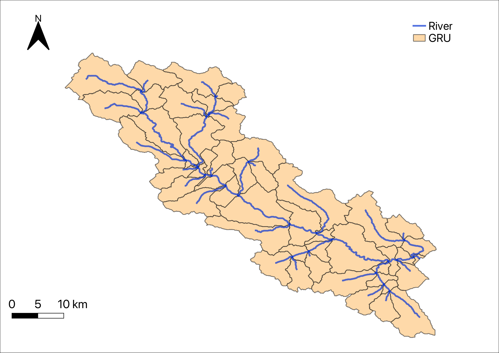

# Bow River at Banff: distributed model execution

This directory contains the serial SUMMA and mizuRoute example for the distributed Bow River basin upstream of the Banff streamflow gauge `CAN_05BB001`. The SUMMA domain contains 52 grouped response units (GRUs), each with one hydrologic response unit (HRU).

SUMMA uses hourly CAMELS-SPAT ERA5 forcing from `CAN_05BB001_era5_distributed_2002_2009.nc`. The configured run covers `2002-10-01 00:00` through `2005-10-01 23:00` and writes daily outputs. mizuRoute routes daily `averageRoutedRunoff_mean` through the 52-segment network in `model/settings/mizuRoute/topology.nc`.

Diagnostics compare simulated streamflow to observed daily flow over `2003-10-01` through `2005-09-30`, excluding the first water year as spin-up. The bundled result has KGE `0.895340`.

## Layout

```text
bow_at_banff_distributed_execution/
├── model/
│   ├── forcing/
│   ├── settings/
│   │   ├── SUMMA/
│   │   └── mizuRoute/
│   ├── shapefiles/
│   └── simulations/
├── obs/
├── results/
└── scripts/
```

`obs/` contains observed daily streamflow for station `CAN_05BB001`.

`model/forcing/4_SUMMA_input/` contains SUMMA meteorological forcing files. The active file is selected by `model/settings/SUMMA/forcingFileList.txt`.

`model/settings/SUMMA/` contains the SUMMA file manager, decisions, output control, attributes, trial parameters, state files, and parameter tables.

`model/settings/mizuRoute/` contains `mizuRoute.control`, `topology.nc`, and `param.nml.default`.

`model/shapefiles/` contains GIS inputs used to build the distributed basin and river-network attributes.

`model/simulations/run1/` contains raw SUMMA and mizuRoute outputs for the `run1` case.

`results/` contains `KGE.txt` and `obs_vs_sim.png`, which are diagnostic outputs for the `run1` case.

`scripts/run_SUMMA_mizuRoute.sh` runs the 52 GRUs serially with SUMMA.

## Serial execution

Run the model from this directory:

```sh
./scripts/run_SUMMA_mizuRoute.sh
```

The command assumes that `python`, `summa.exe`, `mizuRoute.exe`, and NCO tools (`ncks`, `ncap2`, and `ncrcat`) are available. Override executable paths when needed:

```sh
PYTHON=/path/to/python \
SUMMA_EXE=/path/to/summa.exe \
MIZUROUTE_EXE=/path/to/mizuRoute.exe \
./scripts/run_SUMMA_mizuRoute.sh
```

During a run, `model_run.log` records phases, previous `run1` outputs are removed, and regenerated diagnostics are written to `results/`.

Remove generated `run1` outputs, diagnostics, and `model_run.log` with:

```sh
./scripts/clear_outputs.sh
```

## Hongli add: ##
## Learning Activity: Parallel Execution of a Distributed Hydrologic Model

In this activity, you will learn how to apply **domain decomposition** to a distributed hydrologic model (SUMMA–mizuRoute) and evaluate computational performance using parallel scaling metrics.
- **SUMMA (Structure for Unifying Multiple Modeling Alternatives):** simulates land surface processes for each Grouped Response Unit (GRU).
- **mizuRoute:** routes runoff from GRUs through the river network to generate streamflow.

Together, SUMMA–mizuRoute forms a widely used distributed hydrologic modeling framework.

A key feature of this workflow is that SUMMA computations for different GRUs are independent, making the model well suited for **spatial parallelization**. While mizuRoute performs river routing, its computational cost is relatively small compared to SUMMA. Therefore, the primary opportunity for speedup comes from distributing GRU simulations across multiple processors.

The case study uses the **Bow at Banff** basin in the Canadian Rockies. This 2,216 km² snow-dominated watershed is divided into **52 GRUs** to represent spatial variability in land surface processes.



## 1. How SUMMA Executes GRUs

Inspect `run_SUMMA_mizuRoute.sh`.

The script performs the following tasks:

1. Reads model settings and runtime configurations.
2. Executes SUMMA simulations.
3. Concatenates SUMMA outputs from multiple GRUs.
4. Runs mizuRoute using the SUMMA outputs.
5. Produces routed streamflow results and diagnostics.

In `run_SUMMA_mizuRoute.sh`, SUMMA executes GRUs using the following code:

```bash
for gru_index in $(seq 1 "${n_gru}"); do
    "${summa_exe}" -g "${gru_index}" 1 -r never -m "${summa_filemanager}"
done
```

SUMMA allows subsets of GRUs to be simulated using

```bash
summa.exe -m master_file -g startGRU countGRU [-r freqRestart]
```

| Command Argument | Description |
|----------|-------------|
| `startGRU` | Index of the first GRU to simulate |
| `countGRU` | Number of consecutive GRUs to simulate |
| `-r` | Restart control (e.g., `never` disables restart output) |

In the serial script, SUMMA is called as

```bash
-g "${gru_index}" 1
```

This means

- `startGRU = gru_index`
- `countGRU = 1`

Each SUMMA execution therefore simulates **exactly one GRU**.

## 2. CPU Resource Check

Determine the number of CPU cores available on your computer.

```bash
python -c "import os; print(os.cpu_count())"
```

**Record the CPU cores available on your machine.**

<details>
<summary>Solution</summary>
System dependent (e.g., 4, 8, 12, 16, ...).

This value defines the maximum number of cores you will use in the scaling experiments.
</details>

## 3. Serial Baseline Run

Run the model using the original serial implementation.

```bash
time bash scripts/run_SUMMA_mizuRoute.sh
```

Let

$$
T_1 = \text{runtime using one core}
$$

**Record the baseline runtime $$(T_1$$).**

<details>
<summary>Solution</summary>

```
Example: T1 = 360 seconds
```
</details>

### Scaling Results

Fill in the following table as you complete each experiment.

| Number of Cores (p) | Runtime (Tp) | Speedup S(p) | Scaling E(p) |
|---------------------|--------------|--------------|--------------------------|
| 1 | | | |
| 2 | | | |
| 3 | | | |
| 4 | | | |
| Max | | | |

---

## 4. Two-Core Domain Decomposition

The watershed contains 52 GRUs. We can divide the computational domain equally into two cores:

| Core | Assigned GRUs |
|------|---------------|
| Core 1 | 1–26 |
| Core 2 | 27–52 |

Replace the serial loop 

```bash
for gru_index in $(seq 1 "${n_gru}"); do
    "${summa_exe}" -g "${gru_index}" 1 -r never -m "${summa_filemanager}"
done
```

with

```bash
"${summa_exe}" -m "${summa_filemanager}" -g 1 26 -r never &
"${summa_exe}" -m "${summa_filemanager}" -g 27 26 -r never &
wait
```

- `&` launches a process in the background so that both SUMMA simulations execute concurrently.
- `wait` pauses the script until **both** SUMMA processes have completed before continuing to mizuRoute.

**Record the runtime for the two-core experiment $$(T_2$$).**

## 5. Multi-Core Experiments

Repeat the same procedure using

- 3 cores
- 4 cores
- up to the maximum number of CPU cores available on your computer

**Record the runtime for each experiment.**

**Question: What happens to runtime as the number of cores increases?**

<details>
<summary>Solution</summary>

Runtime generally decreases, but not proportionally. This behavior is called **sublinear scaling**.

</details>

## 6. Speedup and Scaling Analysis

### 6.1 Speedup

Compute the speedup for each experiment:

$$
S(p)=\frac{T_1}{T_p}
$$

**Question: Why does speedup become sublinear as the number of cores increases?**

<details>
<summary> Solution</summary>
Several factors contribute:

- Load imbalance among GRUs
- File I/O overhead
- Serial workflow components (concatenation, mizuRoute, diagnostics)
- The limited parallel fraction of the workflow (Amdahl's Law)

</details>

### 6.2 Scaling (or Parallel Efficiency)

Compute the parallel efficiency for each experiment:

$$
E(p)=\frac{S(p)}{p}
$$

**Question (1): Are these experiments evaluating strong scaling or weak scaling?**

<details>
<summary> Solution</summary>

These are **strong scaling** experiments because

- the total number of GRUs (52) remains fixed,
- only the number of CPU cores changes, and
- we measure how runtime decreases for the same computational workload.

</details>

**Question (2): What would ideal strong scaling look like?**

<details>
<summary>Solution</summary>

For ideal strong scaling,

`Tp = T1 / p`

which implies

`S(p) = p`

and

`E(p) = 1`

In practice, ideal scaling is never achieved because of serial components and parallel overhead.

</details>

**Question (3): What is the primary scalability bottleneck in this workflow?**

<details>
<summary> Solution</summary>
The primary bottlenecks are

- imbalance in GRU workloads, and
- serial post-processing (concatenation and routing).

The SUMMA physical model itself is highly amenable to domain decomposition.

</details>
