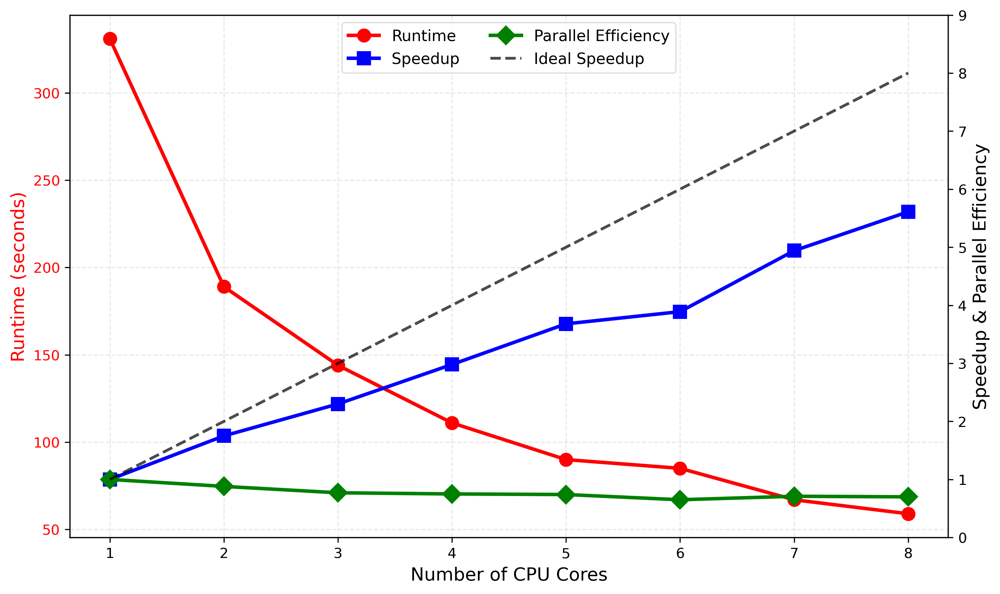

# Sample Solution: Parallel Execution of a Distributed Hydrologic Model

## Serial Workflow

The original workflow executes the distributed SUMMA model sequentially over the 52 grouped response units (GRUs) representing the Bow River basin. For each GRU, SUMMA performs an independent land-surface simulation that generates runoff and other hydrologic fluxes. After all GRUs have been simulated, mizuRoute routes the generated runoff through the river network to the Banff streamflow gauge, where simulated streamflow is compared with observations to compute the modified Kling–Gupta efficiency (KGE').

Although the watershed is spatially distributed, the original implementation is entirely serial because the shell script launches one SUMMA process at a time. Each execution simulates a single GRU (`countGRU = 1`) before moving to the next GRU.

The SUMMA component is naturally parallelizable because GRUs are independent during the land-surface calculations. Each GRU can therefore be assigned to a different CPU core without affecting the results. In contrast, mizuRoute, diagnostic calculations, and output generation occur after all GRUs have finished and therefore remain serial components of the workflow.

Requesting additional CPU cores through Slurm alone does not reduce runtime because the workflow launches only one SUMMA process regardless of how many CPU cores are allocated. Slurm merely reserves additional hardware resources; the workflow itself must also be modified to execute multiple SUMMA processes concurrently.

## Parallelization

To parallelize the workflow, the serial SUMMA loop is replaced by multiple background SUMMA processes, each responsible for a subset of the 52 GRUs. For example, a two-core implementation divides the domain into two equal batches:

```bash
"${summa_exe}" -m "${summa_filemanager}" -g 1 26 -r never &
"${summa_exe}" -m "${summa_filemanager}" -g 27 26 -r never &
wait
```

The `&` operator launches each SUMMA process in the background so they execute simultaneously, while the `wait` command ensures that all SUMMA simulations finish before mizuRoute begins routing.

The Slurm submission script `submit_run.sh` must also be modified so that the allocated computing resources match the parallel workflow. For example, the two-core run requires changing the line

```bash
#SBATCH --cpus-per-task=1
```

to the following:

```bash
#SBATCH --cpus-per-task=2
```

Both files must be modified because they perform different roles. The workflow script determines how many SUMMA processes are launched, whereas the Slurm submission script reserves sufficient CPU cores for those processes. Changing only one of the two files would either leave CPU cores unused or oversubscribe the allocated resources.

The 52 GRUs should be divided as evenly as possible among CPU cores to minimize load imbalance. Example decompositions include 26–26 GRUs for two cores, 18–17–17 for three cores, 13 GRUs each for four cores, and approximately 6–7 GRUs per core for eight cores.

## Performance Evaluation

This exercise evaluates **strong scaling**, where the total computational workload remains fixed while the number of CPU cores increases. Speedup and parallel efficiency are computed as

$$
S_p(N)=\frac{T_1(N)}{T_p(N)}, \qquad
E_p(N)=\frac{S_p(N)}{p}
$$

where $$T_1$$ is the one-core runtime and $$p$$ is the number of allocated CPU cores. The results are summarized in the table below:

| Slurm Job ID | CPU Cores | Runtime (s) | Speedup | Parallel Efficiency |
| ---: | ---: | ---: | ---: | ---: |
|1|1|331|1.00|1.00|
|2|2|189|1.75|0.88|
|3|3|144|2.30|0.77|
|4|4|111|2.98|0.75|
|5|5|90|3.68|0.74|
|6|6|85|3.89|0.65|
|7|7|67|4.94|0.71|
|8|8|59|5.61|0.70|

The following table shows how the 52 GRUs were assigned to each CPU core for different processor counts, noting that the CPU cores are numbered according to the order that the SUMMA processes are launched:

| Slurm Job ID | CPU Cores | Average GRUs per Core | Core 1 | Core 2 | Core 3 | Core 4 | Core 5 | Core 6 | Core 7 | Core 8 |
|---:|---:|---:|:---|:---|:---|:---|:---|:---|:---|:---|
| 1 | 1 | 52.0 | 1–52 | | | | | | | |
| 2 | 2 | 26.0 | 1–26 | 27–52 | | | | | | |
| 3 | 3 | 17.3 | 1–17 | 18–34 | 35–52 | | | | | |
| 4 | 4 | 13.0 | 1–13 | 14–26 | 27–39 | 40–52 | | | | |
| 5 | 5 | 10.4 | 1–10 | 11–20 | 21–30 | 31–41 | 42–52 | | | |
| 6 | 6 | 8.7 | 1–9 | 10–18 | 19–27 | 28–36 | 37–45 | 46–52 | | |
| 7 | 7 | 7.4 | 1–7 | 8–14 | 15–21 | 22–28 | 29–35 | 36–42 | 43–52 | |
| 8 | 8 | 6.5 | 1–6 | 7–12 | 13–18 | 19–24 | 25–31 | 32–38 | 39–45 | 46–52 |

Adding CPU cores substantially reduces runtime, although the measured speedup is less than the ideal linear speedup. The primary reasons for this include serial components of the workflow (such as routing and diagnostics), process-launch overhead, filesystem I/O contention, and load imbalance caused by different GRUs requiring different amounts of computation. The following figure plots the runtime, speedup, and parallel efficiency as a function of the number of CPU cores:



As additional cores are added, these overheads become increasingly important and eventually dominate the execution time. Consequently, there is typically a practical saturation point beyond which requesting additional CPU cores provides little additional reduction in wall-clock runtime. For production simulations, the preferred processor count is often the point just before this performance plateau.

## Recommendation and Reflection

Parallelizing distributed hydrologic simulations substantially reduces model turnaround time, enabling research groups to perform more calibration experiments, sensitivity analyses, uncertainty studies, and scenario simulations within a fixed amount of computing time.

Scaling studies such as this one provide valuable guidance for selecting processor counts in future production runs. Rather than always requesting the maximum available CPU cores, researchers should identify the point where additional resources no longer provide meaningful runtime reductions.

The results also demonstrate the tradeoff between minimizing absolute runtime and maximizing resource efficiency. Although the fastest execution is often obtained using the largest processor count, the highest parallel efficiency usually occurs with fewer CPU cores. Research groups should therefore balance scientific productivity, queue wait times, and efficient resource utilization when selecting computing resources for large distributed simulations.

## Reproducibility Appendix

Final version of `scripts/run_SUMMA_mizuRoute.sh` for the maximum CPU-core configuration (8 cores):

```
# Launch 8 parallel SUMMA processes with GRU decomposition (52 GRUs total)
"${summa_exe}" -m "${summa_filemanager}" -g 1 6 -r never &
"${summa_exe}" -m "${summa_filemanager}" -g 7 6 -r never &
"${summa_exe}" -m "${summa_filemanager}" -g 13 6 -r never &
"${summa_exe}" -m "${summa_filemanager}" -g 19 6 -r never &
"${summa_exe}" -m "${summa_filemanager}" -g 25 7 -r never &
"${summa_exe}" -m "${summa_filemanager}" -g 32 7 -r never &
"${summa_exe}" -m "${summa_filemanager}" -g 39 7 -r never &
"${summa_exe}" -m "${summa_filemanager}" -g 46 7 -r never &

# Wait for all SUMMA processes to complete before routing
wait
```
Note the above only shows the SUMMA model execution part within `scripts/run_SUMMA_mizuRoute.sh`.

Final version of `scripts/submit_run.sh`:
```
#!/bin/bash
#SBATCH --job-name=bow-distributed
#SBATCH --output=slurm-%x-%j.out
#SBATCH --error=slurm-%x-%j.err
#SBATCH --time=00:30:00
#SBATCH --ntasks=8
#SBATCH --cpus-per-task=1
#SBATCH --mem=300MB

# Run the parallel workflow
./scripts/run_SUMMA_mizuRoute.sh
```
Slurm resource information from `sinfo -N -o "%N %P %c %t"`:
```
NODELIST      PARTITION CPUS STATE
slurm-worker1 debug*       4 idle
slurm-worker2 debug*       4 idle
```
