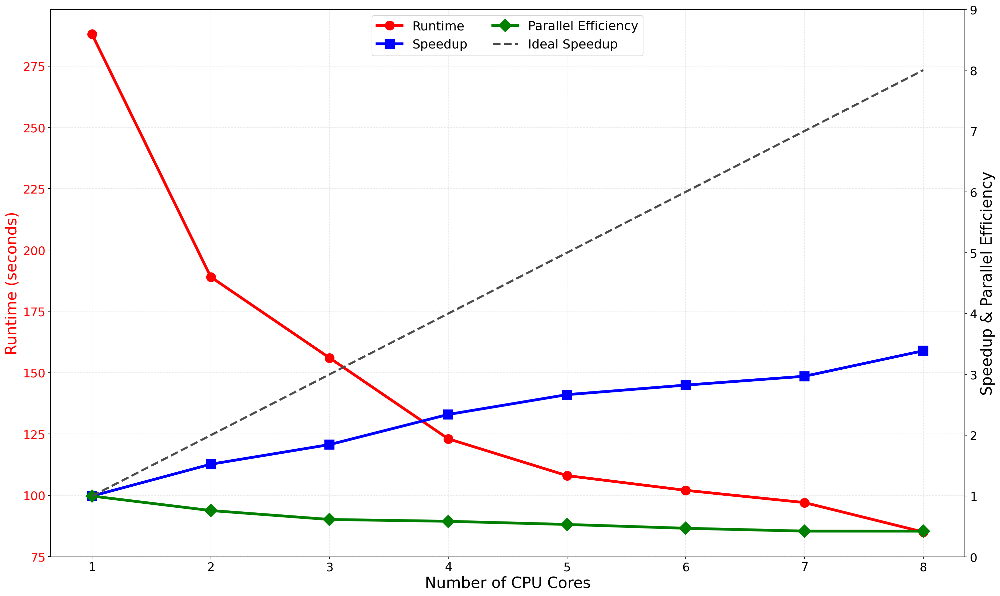

# Sample Solution: Parallel Execution of a Distributed Hydrologic Model

This memo summarizes the conversion of the distributed SUMMA-mizuRoute simulation from serial execution to a parallel workflow that uses multiple CPU cores on a Slurm-managed cluster.

The results reported in this memo were obtained on the [`vhpc-hydrotools`](https://github.com/tristanmontoya/vhpc-hydrotools) virtual HPC cluster, hosted on a MacBook Air M4 with 10 physical CPU cores.

## Serial Workflow

The serial workflow executes the distributed SUMMA model over the 52 grouped response units (GRUs) representing the Bow River basin. One SUMMA process simulates the full domain using `-g 1 52`. For each GRU, SUMMA performs an independent land-surface simulation that generates runoff and other hydrologic fluxes. After all GRUs have been simulated, mizuRoute routes the generated runoff through the river network to the Banff streamflow gauge, where simulated streamflow is compared with observations to compute the modified Kling-Gupta efficiency (KGE').

Although the watershed is spatially distributed, the baseline is entirely serial because one SUMMA process handles all 52 GRUs using one requested CPU core.

The SUMMA component is naturally parallelizable because GRUs are independent during the land-surface calculations. Each GRU can therefore be assigned to a different CPU core without affecting the results. In contrast, output concatenation and post-processing, mizuRoute, and diagnostic calculations occur after all GRUs have finished and therefore remain serial components of the workflow.

Requesting additional CPU cores through Slurm alone does not reduce runtime because the workflow launches only one SUMMA process regardless of how many CPU cores are allocated. Slurm merely reserves additional hardware resources; the workflow itself must also be modified to execute multiple SUMMA processes concurrently.

## Parallelization

To parallelize the workflow, the full-domain SUMMA call is replaced by multiple background SUMMA processes, each responsible for a subset of the 52 GRUs. For example, a two-core implementation divides the domain into two equal batches:

```bash
srun --ntasks=1 --exclusive \
    "${summa_exe}" -m "${summa_filemanager}" -g 1 26 -r never &
srun --ntasks=1 --exclusive \
    "${summa_exe}" -m "${summa_filemanager}" -g 27 26 -r never &
wait
```

Each `srun` command creates one Slurm job step. The `--exclusive` option assigns distinct CPU resources to concurrent job steps, and `--ntasks=1` ensures that each step launches one SUMMA process instead of inheriting the job-level task count. The `&` operator launches each job step in the background so they execute simultaneously, while the `wait` command ensures that all SUMMA simulations finish before mizuRoute begins routing. Each SUMMA task requests one CPU, so the task count equals the requested CPU core count in this workflow.

The Slurm submission script `submit_run.sh` must also be modified so that the allocated computing resources match the parallel workflow. For example, the two-core run requires changing the line

```bash
#SBATCH --ntasks=1
#SBATCH --cpus-per-task=1
```

to the following:

```bash
#SBATCH --ntasks=2
#SBATCH --cpus-per-task=1
```

Both files must be modified because they perform different roles. The workflow script determines how many SUMMA processes are launched, whereas the Slurm submission script reserves sufficient CPU cores for those processes. Changing only one of the two files would either leave CPU cores unused or oversubscribe the allocated resources.

The 52 GRUs should be divided as evenly as possible among CPU cores to minimize load imbalance. Example decompositions include 26–26 GRUs for two cores, 17–17–18 for three cores, 13 GRUs each for four cores, and approximately 6–7 GRUs per core for eight cores. For this study, we selected $p_{\max}=8$ because the virtual cluster provided eight virtual CPU cores, the host machine provided 10 physical CPU cores, and the domain contained more than eight GRUs. The KGE' value was 0.895356 for every core count, matching the one-core result.

## Performance Evaluation

This exercise evaluates **strong scaling**, where the total computational workload remains fixed while the number of CPU cores increases. Speedup and strong-scaling efficiency are computed as

$$
S_p(N)=\frac{T_1(N)}{T_p(N)}, \qquad
E_p(N)=\frac{S_p(N)}{p}
$$

where $T_1(N)$ is the one-core runtime, $T_p(N)$ is the runtime using $p$ cores, and $p$ is the number of requested CPU cores. The results are summarized in the table below:

| Slurm Job ID | Requested CPU Cores | Runtime (s) | Speedup | Strong-Scaling Efficiency |
| ---: | ---: | ---: | ---: | ---: |
| 46 | 1 | 288 | 1.00 | 1.00 |
| 47 | 2 | 189 | 1.52 | 0.76 |
| 48 | 3 | 156 | 1.85 | 0.62 |
| 49 | 4 | 123 | 2.34 | 0.59 |
| 50 | 5 | 108 | 2.67 | 0.53 |
| 51 | 6 | 102 | 2.82 | 0.47 |
| 52 | 7 | 97 | 2.97 | 0.42 |
| 53 | 8 | 85 | 3.39 | 0.42 |

The following table shows how the 52 GRUs were assigned to each CPU core for different processor counts, noting that the CPU cores are numbered according to the order that the SUMMA processes are launched:

| Slurm Job ID | Requested CPU Cores | Average GRUs per Core | Core 1 | Core 2 | Core 3 | Core 4 | Core 5 | Core 6 | Core 7 | Core 8 |
|---:|---:|---:|:---|:---|:---|:---|:---|:---|:---|:---|
| 46 | 1 | 52.0 | 1–52 | | | | | | | |
| 47 | 2 | 26.0 | 1–26 | 27–52 | | | | | | |
| 48 | 3 | 17.3 | 1–17 | 18–34 | 35–52 | | | | | |
| 49 | 4 | 13.0 | 1–13 | 14–26 | 27–39 | 40–52 | | | | |
| 50 | 5 | 10.4 | 1–10 | 11–20 | 21–30 | 31–41 | 42–52 | | | |
| 51 | 6 | 8.7 | 1–9 | 10–18 | 19–27 | 28–36 | 37–44 | 45–52 | | |
| 52 | 7 | 7.4 | 1–8 | 9–16 | 17–24 | 25–31 | 32–38 | 39–45 | 46–52 | |
| 53 | 8 | 6.5 | 1–6 | 7–12 | 13–18 | 19–24 | 25–31 | 32–38 | 39–45 | 46–52 |

The following figure plots the runtime, speedup, and strong-scaling efficiency as a function of the number of CPU cores:



Across the tested range, runtime decreases monotonically with increasing CPU core count, falling from 288 seconds on one core to 85 seconds on eight cores. Correspondingly, the speedup increases monotonically and reaches a maximum of 3.39 on eight cores. Although no hard plateau is reached, the speedup curve shows diminishing returns as additional cores are added, and strong-scaling efficiency declines from 0.76 on two cores to 0.42 on seven and eight cores. As such, increasing the core count effectively reduces runtime, although the measured speedup remains below the ideal linear speedup. Likely sources of this sublinear scaling include serial workflow components, such as routing and diagnostics, as well as process launch overhead, file system I/O contention, and load imbalance arising from differences in the computational requirements of individual GRUs.

## Recommendation and Reflection

Parallelizing distributed hydrologic simulations substantially reduces model turnaround time and enables research groups to perform more calibration experiments, sensitivity analyses, uncertainty studies, and scenario simulations within a fixed amount of time, and to explore more complex model configurations that would otherwise be infeasible. The results show that the Bow River basin workflow continues to benefit from additional CPU resources up to the tested maximum of eight cores, although the gains diminish as more cores are added.

Scaling studies such as this one provide a practical basis for selecting CPU allocations for production runs, and researchers should weigh marginal runtime reductions against declining strong-scaling efficiency rather than automatically requesting the maximum number of available cores. In this study, eight cores minimize runtime, whereas smaller allocations use CPU resources more efficiently. The appropriate allocation therefore depends on the objective: for the present study, eight cores are appropriate when a single result is needed as quickly as possible, while calibration, sensitivity analysis, or uncertainty quantification may benefit from smaller allocations that allow more concurrent simulations at higher strong-scaling efficiency, provided that each simulation uses isolated working directories.

## Reproducibility Appendix

Final version of `scripts/run_SUMMA_mizuRoute.sh` for the maximum CPU-core configuration (8 cores):

```bash
#!/usr/bin/env bash
set -euo pipefail

# Run from the basin directory
cd "$(dirname "${BASH_SOURCE[0]}")/.."

# Define model configuration paths
summa_filemanager="model/settings/SUMMA/fileManager.txt"
route_control="model/settings/mizuRoute/mizuRoute.control"
concat_summa_script="scripts/concat_summa_outputs.py"
diagnostics_script="scripts/calculate_run_diagnostics.py"
log_file="model_run.log"

# Allow executable names to be overridden by the environment
python_exe="${PYTHON:-python}"
summa_exe="${SUMMA_EXE:-summa.exe}"
route_exe="${MIZUROUTE_EXE:-mizuRoute.exe}"

# Read a setting from a SUMMA or mizuRoute text configuration file
read_config_value() {
    local input_file="$1"
    local setting="$2"
    grep -m 1 "^${setting}" "${input_file}" | cut -d '!' -f 1 | cut -d ' ' -f 2- | xargs
}

# Stop early when required inputs are missing
require_file() {
    local input_file="$1"
    if [ ! -f "${input_file}" ]; then
        echo "Missing required file: ${input_file}" >&2
        exit 1
    fi
}

# Require the necessary files for this model run
require_file "${summa_filemanager}"
require_file "${route_control}"
require_file "${concat_summa_script}"
require_file "${diagnostics_script}"

# Log a model-run phase to stdout and the run log
log_step() {
    local message="$1"
    echo "--- ${message} ---"
    printf '%s: %s\n' "$(date)" "${message}" >> "${log_file}"
}

# Read paths and output names from the preconfigured model files
summa_settings_path="$(read_config_value "${summa_filemanager}" "settingsPath")"
summa_output_path="$(read_config_value "${summa_filemanager}" "outputPath")"
summa_out_file_prefix="$(read_config_value "${summa_filemanager}" "outFilePrefix")"
summa_attribute_file="$(read_config_value "${summa_filemanager}" "attributeFile")"
summa_attribute_file="${summa_settings_path%/}/${summa_attribute_file}"
route_output_path="$(read_config_value "${route_control}" "<output_dir>")"
route_out_file_prefix="$(read_config_value "${route_control}" "<case_name>")"

# Check if the attribute file exists before trying to read the GRU count
require_file "${summa_attribute_file}"

# Count GRUs from the SUMMA attributes
n_gru="$(ncks -Cm -v gruId -m "${summa_attribute_file}" \
    | awk '$1 == "gru" && $2 == "=" {n = $3} END {if (n != "") print n}')"
if [ -z "${n_gru}" ]; then
    echo "Unable to determine GRU count from ${summa_attribute_file}" >&2
    exit 1
fi

# Run SUMMA for balanced GRU batches
log_step "run summa"
mkdir -p "${summa_output_path}"
rm -f "${summa_output_path}/${summa_out_file_prefix}"*
srun --ntasks=1 --exclusive \
    "${summa_exe}" -m "${summa_filemanager}" -g 1 6 -r never &
srun --ntasks=1 --exclusive \
    "${summa_exe}" -m "${summa_filemanager}" -g 7 6 -r never &
srun --ntasks=1 --exclusive \
    "${summa_exe}" -m "${summa_filemanager}" -g 13 6 -r never &
srun --ntasks=1 --exclusive \
    "${summa_exe}" -m "${summa_filemanager}" -g 19 6 -r never &
srun --ntasks=1 --exclusive \
    "${summa_exe}" -m "${summa_filemanager}" -g 25 7 -r never &
srun --ntasks=1 --exclusive \
    "${summa_exe}" -m "${summa_filemanager}" -g 32 7 -r never &
srun --ntasks=1 --exclusive \
    "${summa_exe}" -m "${summa_filemanager}" -g 39 7 -r never &
srun --ntasks=1 --exclusive \
    "${summa_exe}" -m "${summa_filemanager}" -g 46 7 -r never &
wait

# Merge split GRU outputs into one file for routing
log_step "concatenate summa outputs"
"${python_exe}" "${concat_summa_script}" --summa-filemanager "${summa_filemanager}"

# Shift daily SUMMA output times to the mizuRoute convention
log_step "post-process summa output"
summa_output_file="${summa_output_path}/${summa_out_file_prefix}_day.nc"
ncap2 -h -O -s 'time[time]=time-86400' "${summa_output_file}" "${summa_output_file}"

# Run mizuRoute on the merged SUMMA output
log_step "run mizuRoute"
mkdir -p "${route_output_path}"
rm -f "${route_output_path}/${route_out_file_prefix}"*
"${route_exe}" "${route_control}"

# Merge mizuRoute outputs when the run produced split output files
route_merged_file="${route_output_path}/${route_out_file_prefix}.mizuRoute.nc"
shopt -s nullglob
route_output_files=("${route_output_path}/${route_out_file_prefix}"*)
shopt -u nullglob

# Check if mizuRoute produced any output files, and merge them if there are multiple
if [ "${#route_output_files[@]}" -eq 0 ]; then
    echo "No mizuRoute output files found in ${route_output_path}" >&2
    exit 1
elif [ "${#route_output_files[@]}" -gt 1 ] \
    || [ "${route_output_files[0]}" != "${route_merged_file}" ]; then
    ncrcat -O -h "${route_output_files[@]}" "${route_merged_file}"
fi

# Calculate run diagnostics from the merged mizuRoute output
log_step "calculate diagnostics"
"${python_exe}" "${diagnostics_script}" --sim-file "${route_merged_file}" \
    --obs-file "obs/obs_flow.CAN_05BB001.cfs.csv" --output-dir "results" \
    --start-date "2003-10-01" --end-date "2005-09-30" --make-plot

log_step "done with model run"
```

Final version of `scripts/submit_run.sh`:
```bash
#!/bin/bash
#SBATCH --job-name=bow-distributed
#SBATCH --output=slurm-%x-%j.out
#SBATCH --error=slurm-%x-%j.err
#SBATCH --time=00:30:00
#SBATCH --ntasks=8
#SBATCH --cpus-per-task=1
#SBATCH --mem=300MB

# Run the parallel workflow
./scripts/run_SUMMA_mizuRoute.sh
```

Slurm resource information from `sinfo -N -o "%N %P %c %t"`:
```text
NODELIST      PARTITION CPUS STATE
slurm-worker1 debug*       4 idle
slurm-worker2 debug*       4 idle
```
