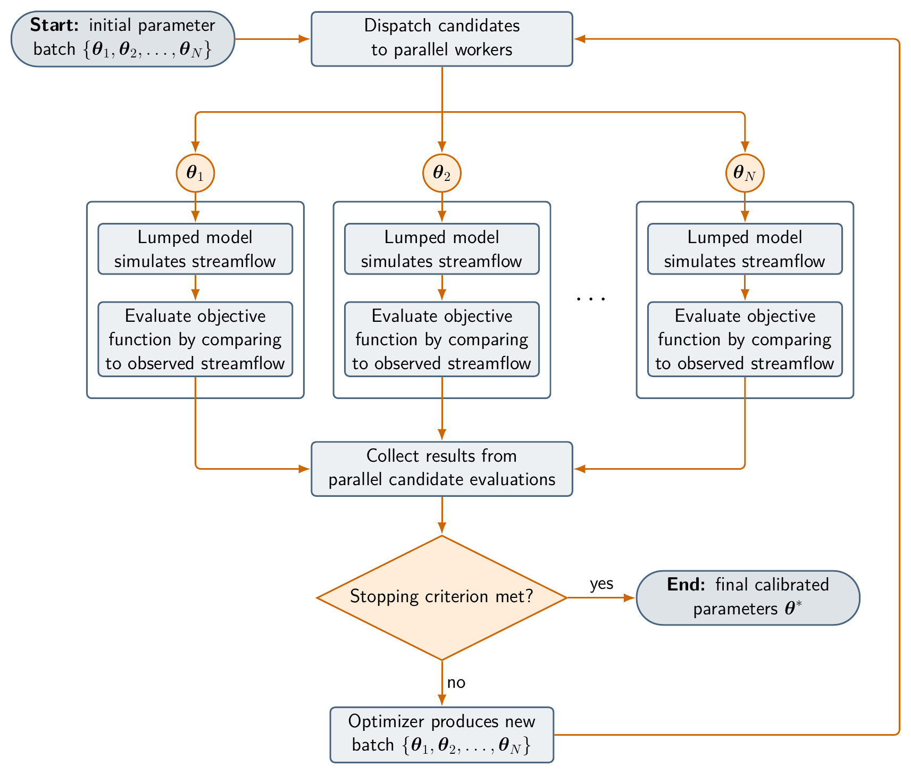

# Scenario 2: Parallel Calibration of a Lumped Hydrologic Model

Read the shared [Activity Overview](../ASSIGNMENT.md) before starting this activity. It defines the scenario, learning objectives, and common memo deliverable.

This activity focuses on a lumped hydrologic model calibration workflow for the Bow River at Banff case. Starting from a serial calibration workflow, you will convert it to a parallel workflow that uses Slurm and MPI, then run a simple scaling test to evaluate the performance of the parallel workflow.

## 1. Serial Workflow

This activity uses OSTRICH to calibrate a lumped SUMMA model for the Bow River basin upstream of the Banff streamflow gauge. The starting point is a serial calibration workflow that uses the Dynamically Dimensioned Search (DDS) algorithm.

Compared with the distributed workflow in Scenario 1, this setup is simplified so that the calibration runs quickly enough for an instructional scaling test. The SUMMA model is configured in lumped form, where all spatial units are aggregated into a single basin representation. A separate routing model, which would normally combine the results from the spatial units to produce a single streamflow hydrograph, is not required in the lumped model.

The diagram below summarizes the serial calibration pattern: OSTRICH proposes one candidate parameter set, the lumped model simulates streamflow, and the objective function is evaluated by comparing the simulated streamflow to observed streamflow.


Conceptually, the calibration problem is to find the normalized calibration vector $\boldsymbol{\theta}^*$ that maximizes agreement between simulated and observed streamflow:

$$
\boldsymbol{\theta}^* = \operatorname*{arg\,max}_{\boldsymbol{\theta} \in [0,1]^N} \operatorname{KGE}\!\left(\mathbf{q}_s(\boldsymbol{\theta}), \mathbf{q}_o\right).
$$

Here, $\boldsymbol{\theta}$ is the normalized calibration vector, $\mathbf{q}_s(\boldsymbol{\theta})$ is the simulated streamflow produced by SUMMA for that parameter vector, $\mathbf{q}_o$ is the observed streamflow over the calibration period, and KGE is the Kling-Gupta efficiency:

$$
\operatorname{KGE} = 1 - \sqrt{(r - 1)^2 + (\alpha - 1)^2 + (\beta - 1)^2},
$$

where $r$ is the correlation, $\alpha$ is the variability ratio, and $\beta$ is the mean bias ratio. Larger KGE values indicate better agreement between simulated and observed streamflow.

If you are using the [`vhpc-hydrotools` virtual cluster](https://github.com/tristanmontoya/vhpc-hydrotools), change into the repository checkout:

```sh
cd /workspace/hydrolearn-hpc
```

If you are using another Slurm cluster, clone the repository yourself in a location of your choice:

```sh
git clone https://github.com/tristanmontoya/hydrolearn-hpc.git
cd hydrolearn-hpc
```

The `main` branch contains a working calibration workflow configured to use the serial DDS algorithm, which evaluates one candidate parameter set at a time. Before editing anything, it is important to understand the structure of the serial program. First, change into the case directory:

```sh
cd bow_at_banff_lumped_calibration
```

Inspect the following files:

```
ostIn.txt
scripts/run_ostrich.sh
scripts/run_trial.sh
scripts/save_best.sh
```

The file `ostIn.txt` defines the OSTRICH calibration workflow, which currently uses `ProgramType DDS`, meaning that the serial dynamic dimensioned search algorithm is used. The `ModelExecutable` line points to `scripts/run_trial.sh`, which runs the SUMMA model and writes the KGE value to `results/KGE.txt`. OSTRICH formulates optimization problems as minimization problems, so `ostIn.txt` defines a negative-KGE cost function and minimizes that value. This is equivalent to maximizing KGE. The `PreserveBestModel` line points to `scripts/save_best.sh`, which copies the best trial parameter file and simulation output to the `output_archive/` directory.

The `scripts/run_ostrich.sh` shell script runs the entire workflow. It launches the serial `ostrich` executable, which reads the `ostIn.txt` file and performs the calibration. The script is shown below:

```bash
#!/usr/bin/env bash
set -euo pipefail

ostrich
```

Your goal is to first run the unchanged serial calibration through Slurm, then modify the optimizer and launch the parallel calibration with Slurm and MPI. At this stage, focus on the structure of the serial workflow: OSTRICH chooses a candidate parameter set, `run_trial.sh` evaluates that candidate by running SUMMA and calculating KGE, and OSTRICH uses the result to choose the next candidate.

Before changing the optimizer, run the serial workflow as a scheduled Slurm job. Do not run the calibration directly on the login or head node, because even the serial calibration consumes shared resources for an extended period. Open `scripts/run_ostrich.sh` and modify it so that it remains a serial OSTRICH run, but is submitted through Slurm:

```bash
#!/usr/bin/env bash
#SBATCH --job-name=serial-calibration
#SBATCH --nodes=1
#SBATCH --ntasks=1
#SBATCH --cpus-per-task=1
#SBATCH --time=00:10:00
#SBATCH --output=slurm-%x-%j.out
set -euo pipefail

ostrich
```

The `#SBATCH` lines request one Slurm task for the serial calibration. Submit the serial calibration from the case directory:

```sh
sbatch scripts/run_ostrich.sh
```

Slurm will print a line such as `Submitted batch job 123456`. Replace `123456` with your job ID when checking the queue:

```sh
squeue -j 123456
```

After the job finishes, use the same job ID to inspect the Slurm log and archived best model:

```sh
less slurm-serial-calibration-123456.out
cat output_archive/KGE.txt
ls output_archive
```

**Deliverable:** the *Serial Workflow* section of your memo must provide a high-level overview of the workflow and address the following questions:

- What would happen if we requested four Slurm tasks for the serial run, for example by setting `--ntasks=4`? Would the workflow run faster? Why or why not?
- What opportunities still exist for parallelism when the optimization algorithm itself is serial?
- What, conceptually, must change in the optimization method to allow parallelism across optimization iterations?

## 2. Parallelization

OSTRICH includes a parallel version of the DDS algorithm called `ParallelDDS`, which evaluates multiple candidate parameter sets at the same time. The parallel DDS algorithm uses MPI to distribute the model evaluations across multiple worker ranks. Each worker rank runs a separate instance of the SUMMA model with a different candidate parameter set, and the results are sent back to the coordinator rank, which manages the optimization process. We will now modify the serial workflow to use the parallel DDS algorithm.

The diagram below summarizes a generic parallel calibration pattern: a batch of candidate parameter sets is dispatched to workers, independent model evaluations run concurrently, and the optimizer collects objective function values before proposing another batch. In this assignment, the worker evaluation is implemented by `scripts/run_trial.sh`, which runs the lumped SUMMA model and writes the KGE value used by OSTRICH.



Open `ostIn.txt`. The serial file needs three main changes:
1. Select the parallel DDS algorithm
2. Tell OSTRICH how to create worker directories
3. Replace the serial DDS algorithm block that specifies the parameters with a `ParallelDDS` block using the same parameters.

First, change the program type from serial DDS to `ParallelDDS`:

```diff
-ProgramType  DDS
+ProgramType  ParallelDDS
```

This changes the OSTRICH optimizer while keeping the model execution workflow intact.

Next, add a worker-directory prefix after `ModelExecutable`:

```diff
 ModelExecutable ./scripts/run_trial.sh
+ModelSubdir ostrich_worker_
```

This tells OSTRICH to create separate working directories such as `ostrich_worker_0`, `ostrich_worker_1`, and so on, for each MPI rank to write to as they run model simulations in parallel. Immediately after `ModelSubdir`, add a block that specifies the extra directories that each worker needs:

```diff
+BeginExtraDirs
+model
+obs
+ostrich
+scripts
+EndExtraDirs
```

Finally, replace the serial DDS algorithm block with a `ParallelDDS` block:

```diff
-BeginDDSAlg
+BeginParallelDDSAlg
 PerturbationValue 0.20
 MaxIterations 40
 UseInitialParamValues
-EndDDSAlg
+EndParallelDDSAlg
```

Next, open `scripts/run_ostrich.sh` again and modify the serial Slurm script so that it launches `OstrichMPI` with `srun`.

ParallelDDS uses one coordinator MPI rank in addition to the model-evaluation worker ranks, so each run needs one more total task than the number of model-evaluation workers.

On the `vhpc-hydrotools` virtual cluster, request an allocation of 5 total tasks (`--ntasks=5`) so that the largest scaling case, which uses four model-evaluation workers plus one coordinator, can run. The virtual cluster imitates a small Slurm cluster with two nodes, each with four cores, although in actuality it runs on your local machine and uses whatever resources are available.

The script below uses the virtual cluster resource layout; if you are using another Slurm cluster, you should adapt `--nodes`, `--ntasks`, and `--ntasks-per-node` to make effective use of the available hardware. You may also need to adjust the `--time` limit to allow enough time for the scaling study to complete.

Although the instructions assume a maximum of four model-evaluation workers, you may choose to run larger cases, for example, by changing the `for worker_count in 1 2 4; do` line in the script below. If you do so, make sure that your Slurm allocation has enough resources to run the largest scaling case, plus one coordinator rank.

As the script iterates over the worker counts, each `srun` call should request one more total task than the number of workers. The first scaling run therefore uses one model-evaluation worker and one coordinator, for a total of 2 MPI ranks. This `nworkers=1` run is the baseline for the strong-scaling calculation. Use the complete launch script below; its central parallelization step is the `srun --ntasks="${task_count}" OstrichMPI` call inside the worker-count loop, and the remaining output-handling lines preserve reproducible timing and best-model archives.

```bash
#!/usr/bin/env bash
#SBATCH --job-name=parallel-calibration
#SBATCH --nodes=2
#SBATCH --ntasks=5
#SBATCH --ntasks-per-node=4
#SBATCH --time=08:00:00
#SBATCH --output=slurm-%x-%j.out
set -euo pipefail

# Preserve best models in the original case directory
export PARALLEL_CALIBRATION_ROOT="${PWD}"

# Create a summary file for the scaling study
summary_file="strong_scaling_summary_${SLURM_JOB_ID}.csv"
archive_root="scaling_archive_${SLURM_JOB_ID}"
printf "nworkers,ntasks,seconds,best_kge,archive_dir\n" > "${summary_file}"
mkdir -p "${archive_root}"
cp ostIn.txt scripts/run_ostrich.sh "${archive_root}/"

# ParallelDDS uses one coordinator rank in addition to the worker ranks
for worker_count in 1 2 4; do
    # Calculate the total number of tasks needed for this worker count
    task_count=$((worker_count + 1))

    # Set the output archive directory for this worker-count run
    run_archive="${archive_root}/workers_${worker_count}"
    export OUTPUT_ARCHIVE_DIR="${PWD}/${run_archive}/output_archive"

    # Clean previous run artifacts
    rm -rf ostrich_worker_* Ost*.txt model_run.log "${run_archive}"

    # Make a fresh output archive directory
    mkdir -p "${OUTPUT_ARCHIVE_DIR}"

    # Start the timer for this worker-count run
    start_time="${SECONDS}"

    # Run the parallel calibration with the current worker count
    srun --ntasks="${task_count}" OstrichMPI

    # Calculate the elapsed time for this worker-count run
    elapsed_seconds=$((SECONDS - start_time))

    # Read the best KGE from the current run into the variable `best_kge`
    best_kge="NA"
    if [ -f "${OUTPUT_ARCHIVE_DIR}/KGE.txt" ]; then
        read -r best_kge _ < "${OUTPUT_ARCHIVE_DIR}/KGE.txt"
    fi

    # Keep output_archive aligned with the latest completed run
    rm -rf output_archive
    cp -r "${OUTPUT_ARCHIVE_DIR}" output_archive

    printf "%s,%s,%s,%s,%s\n" "${worker_count}" "${task_count}" "${elapsed_seconds}" \
        "${best_kge}" "${run_archive}" >> "${summary_file}"
done
```

**Deliverable:** the *Parallelization* section of your memo must address the following questions:

- Why do the worker directories need multiple copies of `model`, `obs`, `ostrich`, and `scripts`?
- If the `MaxIterations` is kept fixed at 40 and we increase the number of MPI ranks, and the random seed is fixed, will the same parameter sets be evaluated in each run?

## 3. Performance Evaluation

Submit the job from the case directory:

```sh
cd /path/to/hydrolearn-hpc/bow_at_banff_lumped_calibration
sbatch scripts/run_ostrich.sh
```

Slurm will print a line such as `Submitted batch job 123456`. Replace `123456` with your job ID when checking the queue:

```sh
squeue -j 123456
```

After the job finishes, use the same job ID to inspect the Slurm log and archived best model:

```sh
less slurm-parallel-calibration-123456.out
cat output_archive/KGE.txt
ls output_archive
```

Inspect the summary file, which lists the timings, per-worker archives, and best KGE values:

```sh
cat strong_scaling_summary_123456.csv
```

Based on the summary file, create a table with these columns:

- Total MPI tasks
- Number of model-evaluation workers
- Runtime in seconds
- Speedup relative to the one-worker case
- Strong-scaling efficiency with respect to the number of workers

Compute the following quantities using the notation from the module slides:

- Speedup relative to the one-worker case: $S_p(N) = T_1(N) / T_p(N)$
- Strong-scaling efficiency with respect to model-evaluation workers: $E_p(N) = S_p(N) / p$

Here, $N$ is the fixed calibration workload, $p$ is the number of model-evaluation workers, $T_1(N)$ is the runtime using one model-evaluation worker, and $T_p(N)$ is the runtime using $p$ model-evaluation workers. The coordinator rank is required for `ParallelDDS`, but it is not counted as a model-evaluation worker in the efficiency calculation.

**Deliverable:** the *Performance Evaluation* section of your memo must report the summary file, the strong-scaling table, the speedup values, and the parallel efficiency values. Briefly interpret whether adding workers improved runtime and whether the speedup was close to ideal.

## 4. Recommendation and Reflection

**Deliverable:** the *Recommendation and Reflection* section of your memo must address the following questions:

- What is the practical value of parallelizing this calibration workflow? How might the research group use this capability in their work?
- Are all requested Slurm resources used throughout the duration of the scaling study, or are some left idle?
- What changes could be made to improve resource utilization in this workflow?

## 5. Reproducibility Appendix

At the end of your memo, include an appendix that contains the information needed to reproduce your results.

**Deliverable:** the *Reproducibility Appendix* section of your memo must include:

- The final `ostIn.txt` and `scripts/run_ostrich.sh`.
- The contents of `strong_scaling_summary_123456.csv`, where `123456` is the Slurm job ID of your scaling study.
- The per-worker best KGE values reported in `strong_scaling_summary_123456.csv`.
- The best KGE value from the final parallel run, mirrored in `output_archive/KGE.txt`.
