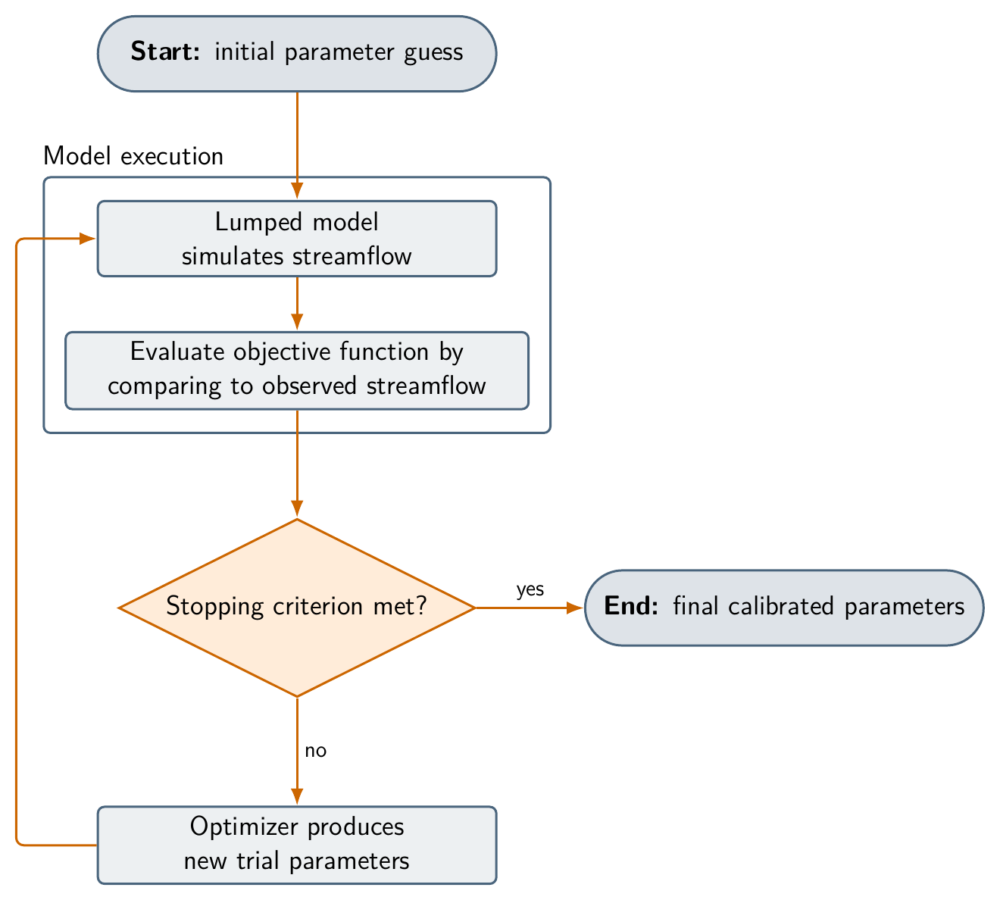
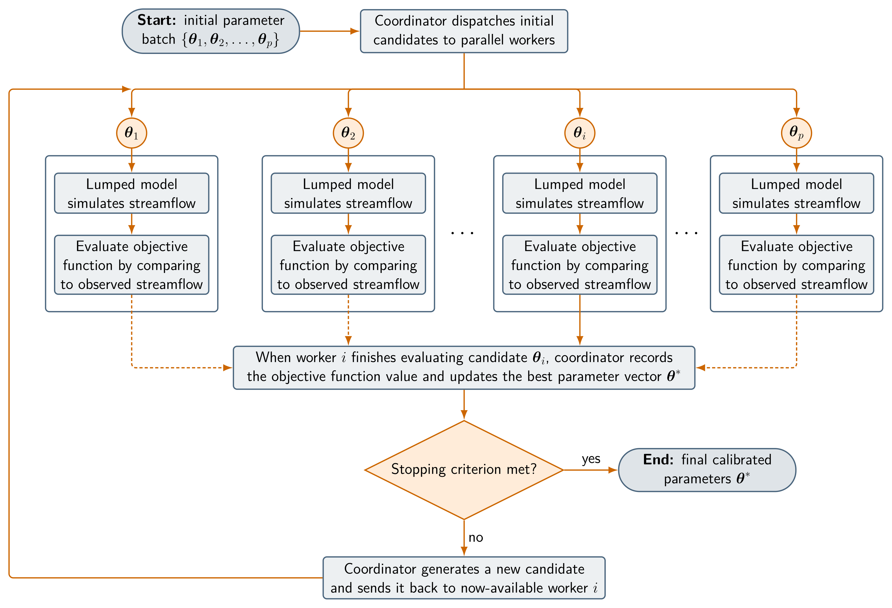

# Scenario 2: Parallel Calibration of a Lumped Hydrologic Model

This scenario focuses on a lumped hydrologic model calibration workflow for the watershed upstream of the `CAN_05BB001` gauge on the Bow River at Banff, Alberta, Canada. Starting from a serial calibration workflow, you will convert it to a parallel workflow that uses Slurm and MPI, then run a simple scaling test to evaluate the performance of the parallel workflow.

## 1. Serial Workflow

In this scenario, the OSTRICH optimization toolkit is used to calibrate a lumped SUMMA model for the watershed upstream of the Banff gauge. The starting point is a serial calibration workflow that uses the Dynamically Dimensioned Search (DDS) algorithm.

Compared with the distributed workflow in Scenario 1, this setup is simplified so that the calibration runs quickly enough for an instructional scaling test. The SUMMA model is configured in lumped form, where all spatial units are aggregated into a single basin representation. A separate routing model, which would normally combine the results from the spatial units to produce a single streamflow hydrograph, is not required in the lumped model.

The figure below illustrates the serial calibration pattern: OSTRICH proposes one candidate parameter set, the lumped model simulates streamflow, and the objective function is evaluated by comparing the simulated streamflow to observed streamflow:



Conceptually, the calibration problem is to find the calibration vector $\boldsymbol{\theta}^*$ that maximizes agreement between simulated and observed streamflow. More precisely, we seek a parameter vector $\boldsymbol{\theta}^*$ that maximizes the modified Kling-Gupta efficiency (KGE') between the simulated streamflow $\mathbf{q}_s(\boldsymbol{\theta})$ and the observed streamflow $\mathbf{q}_o$ over the calibration period:

$$
\boldsymbol{\theta}^* = \arg\max_{\boldsymbol{\theta} \in \boldsymbol{\Theta}}\, \mathrm{KGE}^{\prime}\!\left(\mathbf{q}_s(\boldsymbol{\theta}), \mathbf{q}_o\right).
$$

Here, $\boldsymbol{\theta}$ is the vector of parameter multipliers, $\boldsymbol{\Theta} \subset \mathbb{R}^d$ is the bounded parameter domain defined by the lower and upper limits specified in `ostIn.txt`, $d$ is the number of parameters being calibrated, and KGE' ([Kling et al., 2012](https://doi.org/10.1016/j.jhydrol.2012.01.011)) is defined as

$$
\mathrm{KGE}^{\prime} = 1 - \sqrt{(r - 1)^2 + (\gamma - 1)^2 + (\beta - 1)^2}.
$$

In this expression, $r = \mathrm{corr}(\mathbf{q}_s, \mathbf{q}_o)$ is the correlation, $\gamma = (\sigma_s / \mu_s) / (\sigma_o / \mu_o)$ is the coefficient-of-variation ratio, and $\beta = \mu_s / \mu_o$ is the mean bias ratio, where $\mu_s$ and $\mu_o$ are the simulated and observed means, and $\sigma_s$ and $\sigma_o$ are the corresponding standard deviations. Larger KGE' values indicate better agreement between simulated and observed streamflow.

If you are using the [`vhpc-hydrotools` virtual cluster](https://github.com/tristanmontoya/vhpc-hydrotools), change into the repository checkout:

```sh
cd /workspace/hydrolearn-hpc
```

If you are using another Slurm cluster, clone the repository yourself in a location of your choice:

```sh
git clone https://github.com/tristanmontoya/hydrolearn-hpc.git
cd hydrolearn-hpc
```

The repository contains a working calibration workflow configured to use the serial DDS algorithm, which evaluates one candidate parameter set at a time. Before editing anything, it is important to understand the structure of the serial program. First, change into the case directory:

```sh
cd bow_at_banff_lumped_calibration
```

Inspect the following files:

```
ostIn.txt
scripts/run_ostrich.sh
scripts/run_trial.sh
scripts/save_best.sh
```

The file `ostIn.txt` defines the OSTRICH calibration workflow, which currently uses `ProgramType DDS`, meaning that the serial dynamically dimensioned search algorithm is used. The `ModelExecutable` line points to `scripts/run_trial.sh`, which runs the SUMMA model and writes the KGE' value to `results/KGE.txt`. The diagnostics compare daily streamflow from October 1, 2003, through September 30, 2005. OSTRICH formulates optimization problems as minimization problems, so `ostIn.txt` defines the negative of KGE' as the cost function and minimizes that value. This is equivalent to maximizing KGE'. The `PreserveBestModel` line points to `scripts/save_best.sh`, which copies the best trial parameter file and simulation output to the `output_archive/` directory.

The `scripts/run_ostrich.sh` shell script runs the entire workflow. It launches the serial `ostrich` executable, which reads the `ostIn.txt` file and performs the calibration:

```bash
#!/usr/bin/env bash
set -euo pipefail

ostrich
```

Your goal is to first run the unchanged serial calibration through Slurm, then modify the optimizer and launch the parallel calibration with Slurm and MPI. At this stage, focus on the structure of the serial workflow: OSTRICH chooses a candidate parameter set, `run_trial.sh` evaluates that candidate by running SUMMA and calculating KGE', and OSTRICH uses the result to choose the next candidate.

Before changing the optimizer, run the serial workflow as a scheduled Slurm job. Do not run the calibration directly on the login or head node, because even the serial calibration consumes shared resources for an extended period. Open `scripts/run_ostrich.sh` and modify it so that it remains a serial OSTRICH run, but is submitted through Slurm:

```bash
#!/usr/bin/env bash
#SBATCH --job-name=bow-lumped-calib
#SBATCH --nodes=1
#SBATCH --ntasks=1
#SBATCH --cpus-per-task=1
#SBATCH --time=01:00:00
#SBATCH --output=slurm-%x-%j.out
set -euo pipefail

ostrich
```

The `#SBATCH` lines request one Slurm task for the serial calibration. Submit the serial calibration from the case directory:

```sh
sbatch scripts/run_ostrich.sh
```

Slurm will print a line such as `Submitted batch job 123456`. Then use `squeue` to monitor the job status:

```sh
squeue -u "$USER" --Format=JobID,Name,StateCompact:4,TimeUsed:8,NumTasks:8,NodeList
```

After the job finishes, use the same job ID to inspect the Slurm log and archived best model:

```sh
cat slurm-bow-lumped-calib-123456.out
cat output_archive/KGE.txt
ls output_archive
```

**Deliverable:** the *Serial Workflow* section of your memo must provide a high-level overview of the workflow and address the following questions:

- What would happen if we requested multiple Slurm tasks for the serial run, for example by setting `--ntasks=4`? Would the workflow run faster? Why or why not?
- What opportunities still exist for parallelism when the optimization algorithm itself is serial?
- What, conceptually, must change in the optimization method to allow parallelism across optimization iterations?

## 2. Parallelization

OSTRICH includes a parallel version of the DDS algorithm, which evaluates multiple candidate parameter sets at the same time. The parallel DDS algorithm uses MPI to distribute the model evaluations across multiple worker ranks. Each worker rank runs a separate instance of the SUMMA model with a different candidate parameter set, and the results are sent back to the coordinator rank, which manages the optimization process. We will now modify the serial workflow to use the parallel DDS algorithm.

The figure below illustrates the asynchronous parallel DDS workflow used in this exercise. The coordinator dispatches candidate parameter sets to available workers, and each worker independently executes `scripts/run_trial.sh` to run the lumped SUMMA model and calculate KGE'. When a worker completes an evaluation, the coordinator incorporates the returned objective function value into the search and, if the evaluation budget is not exhausted, dispatches a new candidate to that worker without waiting for the other workers to finish their current evaluations:



To use the parallel DDS algorithm, you will first modify the OSTRICH input file `ostIn.txt`, which is initially set up to run the serial DDS algorithm. Three main changes are required to `ostIn.txt` to switch from serial to parallel DDS:

1. Select the parallel DDS algorithm
2. Tell OSTRICH how to create worker directories
3. Replace the serial `BeginDDSAlg`/`EndDDSAlg` block that specifies the parameters with a `BeginParallelDDSAlg`/`EndParallelDDSAlg` block using the same parameters.

First, change `ProgramType DDS` to `ProgramType ParallelDDS` by replacing

```text
ProgramType  DDS
```

with the following line:

```text
ProgramType  ParallelDDS
```

This changes the OSTRICH optimizer without changing the model execution workflow. Next, after the `ModelExecutable ./scripts/run_trial.sh` line, add a `ModelSubdir` line that specifies the prefix for the worker directories:

```text
ModelSubdir ostrich_worker_
```

This tells OSTRICH to create separate working directories such as `ostrich_worker_0`, `ostrich_worker_1`, and so on, for each MPI rank to write to as model simulations run in parallel. After the `EndFilePairs` line, add a `BeginExtraDirs`/`EndExtraDirs` block that specifies the extra directories to copy into each worker directory:

```text
BeginExtraDirs
model
obs
ostrich
scripts
EndExtraDirs
```

Finally, replace the serial `BeginDDSAlg`/`EndDDSAlg` block

```text
BeginDDSAlg
PerturbationValue 0.20
MaxIterations 40
UseInitialParamValues
EndDDSAlg
```

with the parallel `BeginParallelDDSAlg`/`EndParallelDDSAlg` block:

```text
BeginParallelDDSAlg
PerturbationValue 0.20
MaxIterations 40
UseInitialParamValues
EndParallelDDSAlg
```

`MaxIterations 40` sets a fixed search budget of 40 objective function evaluations. After the search evaluations finish, OSTRICH runs the best parameter set once more on the coordinator rank so that `PreserveBestModel` can save its outputs. The complete timed workflow therefore invokes the model 41 times, even though the optimization budget remains 40 evaluations.

Next, open `scripts/run_ostrich.sh` again and modify the serial Slurm script so that it launches `OstrichMPI` with `srun`.

Before choosing the largest worker count, inspect the CPU resources that Slurm can allocate:

```sh
sinfo -N -o "%N %P %c %t"
```

The `-N` option prints one line per node. The `-o` option selects the output columns: `%N` is the node name, `%P` is the partition name, `%c` is the number of CPUs on the node, and `%t` is the node state. Use this information to choose the largest feasible number of MPI tasks for your allocation.

The parallel DDS algorithm uses one coordinator MPI rank in addition to the model-evaluation worker ranks. Therefore, a run with $p$ workers needs $p + 1$ total MPI tasks. The script below is configured for the `vhpc-hydrotools` virtual cluster. It requests 8 total tasks (`--ntasks=8`) by default, which corresponds to seven model-evaluation workers plus one coordinator. In the scaling study that follows, you will override `--ntasks` when submitting each job. If you are using another Slurm cluster, adapt `--ntasks` and `--time` to fit your allocation and the largest worker count you plan to test:

```bash
#!/usr/bin/env bash
#SBATCH --job-name=bow-lumped-calib
#SBATCH --ntasks=8
#SBATCH --time=01:00:00
#SBATCH --output=slurm-%x-%j.out
set -euo pipefail

# Use the submission directory as the source case
case_dir="${SLURM_SUBMIT_DIR:-${PWD}}"

# Run each job in a separate copied case directory
run_dir="${case_dir}/scaling_archive_${SLURM_JOB_ID}"
mkdir -p "${run_dir}"
cp -R "${case_dir}/ostIn.txt" "${case_dir}/model" "${case_dir}/obs" \
    "${case_dir}/ostrich" "${case_dir}/scripts" "${run_dir}/"
cd "${run_dir}"

# Archive best models inside this job directory
export PARALLEL_CALIBRATION_ROOT="${PWD}"
export OUTPUT_ARCHIVE_DIR="${PWD}/output_archive"

# Run the parallel calibration with all allocated tasks
srun --ntasks="${SLURM_NTASKS}" OstrichMPI
```

**Deliverable:** the *Parallelization* section of your memo must address the following questions:

- Why do the worker directories need multiple copies of `model`, `obs`, `ostrich`, and `scripts`?
- If `MaxIterations` is kept fixed at 40 and we increase the number of MPI ranks, and the random seed is fixed, will the same parameter sets be evaluated in each run?

## 3. Performance Evaluation

Submit one job for each worker count from the case directory. Set `--ntasks` to $p+1$ where $p$ is the number of model-evaluation workers. The command-line `--ntasks` value overrides the default in `scripts/run_ostrich.sh`. Because each job creates a separate copied case directory under `scaling_archive_${SLURM_JOB_ID}/`, these jobs can be submitted at the same time. The example below submits jobs for 2, 3, 4, 5, 6, 7, and 8 total MPI tasks (1 through 7 model-evaluation workers):

```sh
sbatch --ntasks=2 scripts/run_ostrich.sh
sbatch --ntasks=3 scripts/run_ostrich.sh
sbatch --ntasks=4 scripts/run_ostrich.sh
sbatch --ntasks=5 scripts/run_ostrich.sh
sbatch --ntasks=6 scripts/run_ostrich.sh
sbatch --ntasks=7 scripts/run_ostrich.sh
sbatch --ntasks=8 scripts/run_ostrich.sh
```

On a larger Slurm system, continue the same pattern with higher `--ntasks` values if your allocation supports them. You could also submit the jobs in a loop, for example:

```sh
for ntasks in {2..8}; do
    sbatch --ntasks="${ntasks}" scripts/run_ostrich.sh
done
```

For each of these `sbatch` commands, Slurm will print a line such as `Submitted batch job 123456`, with a different job ID for each submitted job. Then use `squeue` to monitor the job status:

```sh
squeue -u "$USER" --Format=JobID,Name,StateCompact:4,TimeUsed:8,NumTasks:8,NodeList
```

After each job finishes, use the same job ID to inspect the Slurm log and archived best model:

```sh
cat slurm-bow-lumped-calib-123456.out
cat scaling_archive_123456/output_archive/KGE.txt
ls scaling_archive_123456/output_archive
```

Then run `sacct` for each completed job, replacing `123456` with the corresponding job ID:

```sh
sacct -j 123456.0 --format=JobID,NTasks,Elapsed
```

The `.0` suffix selects the `OstrichMPI` job step. Based on the Slurm accounting output and the per-job archives, create a table with these columns:

- Slurm job ID
- Total MPI tasks
- Number of model-evaluation workers (`NTasks - 1`)
- Best KGE' value from the `output_archive/KGE.txt` file
- Wall-clock runtime (`Elapsed`)
- Speedup relative to the one-worker case
- Parallel efficiency

Use the following formulas to compute the speedup and parallel efficiency:

- Speedup relative to the one-worker case: $S_p(N) = T_1(N) / T_p(N)$
- Parallel efficiency with respect to model-evaluation workers: $E_p(N) = S_p(N) / p$

Following the notation from Section 1.3 of this module, $N$ represents the fixed budget of 40 search evaluations, $p$ is the number of model-evaluation workers, $T_1(N)$ is the runtime using one model-evaluation worker, and $T_p(N)$ is the runtime using $p$ model-evaluation workers. The coordinator rank is required for the parallel DDS algorithm, but it is not counted as a model-evaluation worker in the efficiency calculation.

**Deliverable:** the *Performance Evaluation* section of your memo must report the Slurm job IDs, the scaling table, speedup values, and parallel efficiency values. It must also address the following questions:

- Did adding model-evaluation workers improve runtime?
- Was the speedup close to ideal?
- If the speedup was not ideal, what factors might have limited the parallel efficiency of this calibration workflow?
- Is there a point beyond which adding model-evaluation workers no longer meaningfully reduces runtime? If so, identify that point and suggest reasons for the observed performance plateau.

## 4. Recommendation and Reflection

**Deliverable:** the *Recommendation and Reflection* section of your memo must address the following questions:

- What is the practical value of parallelizing this calibration workflow, and how might the hydrologic modeling research group benefit from using this capability in their work?
- Why should the different worker counts be submitted as separate Slurm jobs rather than as a single job that runs multiple worker counts in sequence?
- Why, in this scaling study, do the different worker counts result in different objective function values? How does this affect the interpretation of the scaling results?
- How might the research group use scaling studies such as this one to inform future calibration studies?

## 5. Reproducibility Appendix

At the end of your memo, include an appendix that contains the information needed to reproduce your results.

**Deliverable:** the *Reproducibility Appendix* section of your memo must include:

- The final `ostIn.txt` and `scripts/run_ostrich.sh`.
- The Slurm resource information from `sinfo -N -o "%N %P %c %t"` used to choose worker counts.
